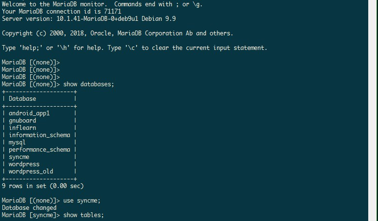

# SyncMe_SERVER



## Collection Explanation

### user_profile 

```json
{
    "_id": "\\MongoDB\\Driver\\ObjectId()",
    "user_id": "user 콜렉션의 \\MongoDB\\Driver\\ObjectId()",
    "photo": [
        {
            "filename": "encrpyt(id + time + filename)",
            "filetype": "integer",
            "filesize": "integer",
            "virtual_dir": "z00000000",
            "tag": "1[, 2, 3, 4]",
            "timestamp": "\\MongoDB\\Driver\\UTCObject()"
        },
    ],
    "nickname": "",
    "religion": "",
    "age": "integer",
    "gender": "1 or 2",
    "distance": "integer",
    "hobby": [
        "ObjectId("")",
        "ObjectId("")"
    ],
    "food": [
        "ObjectId("")",
        "ObjectId("")"
    ],
    "introduce": ""
}
```

- TODO
    - 인덱스 작성
    - 라이브 서버에도 콜렉션 생성
    - photo 필드는 계속 배열로 쌓이는데 최신 `tag` 필드 `GROUP BY`로 날짜순 4개만 가져올 수 있는지 확인